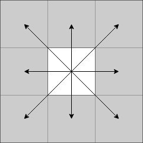
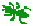
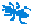
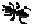
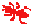
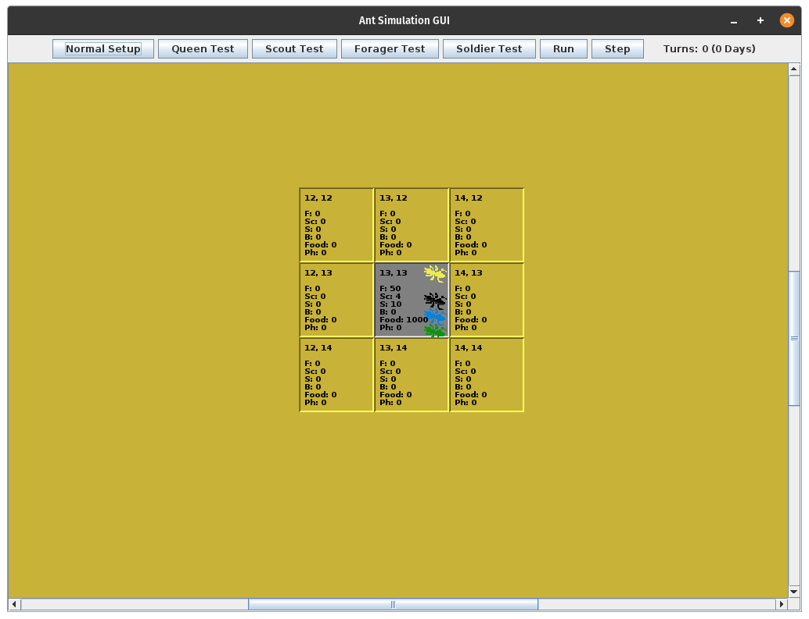
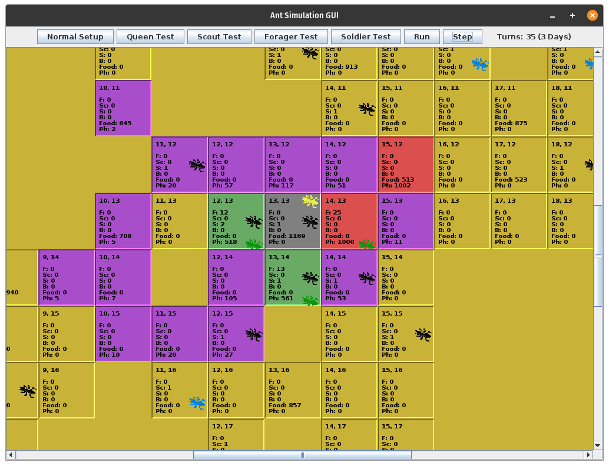

# Ant Colony Simulation
The Ant Colony Simulation was my final project for my Data Structure and Algorithm class, CSC 385. The purpose of this project was to demonstrate my knowledge of data structures while demonstrating a property known as *emergence*.

The combined individual behaviors of all the ants bring about the *emergence* of a **self organized system**: the colony itself. Each ant lives for about one year, except for the queen, which can live for 20 years or more. The colony can survive as long as the queen still lives, meaning the colony can also survive for 20 years or more.

Since the individual ants only live for about a year, the colony isn't able to benefit from the wisdom of old "wise" ants. The colony lives simply because each individual ant  does what is has been programmed to do. A well ordered ant society emerges from the synergistic actions of the individuals.

The colony I created consist of a queen and her brood, which will have workers to gather food and scout the terrain surrounding the colony, and soldiers to protect the colony from enemies. The colony will start off with only the queen ant and a few workers and soldiers. Over time the colony will expand to function like a real ant colony.

## The Environment
- The ants' environment is represented by a 27 x 27 square grid.
- Each square in the grid represents a discrete location in the environment.
- Eight directions of movement are possible.

- The entrance to the colony is represented by a single square located in the center of the grid. The queen is located in this square.
- The remaining squares will initially be unexplored terrain.
- Certain ants (scout ants) are capable of revealing the areas that have not been explored.
- All other types of ants will only be allowed to move into squares that have been revealed by scout ants (excluding enemy ants, discussed later).
- Each square can contain one or more of the following, in any combination:
    - Zero or more enemy ants
    - Zero or more friendly ants
    - Zero or more units of food
    - Zero or more units of pheromone

## Ant Types
There are five types of ants in the simulation:

1. Queen 
2. Forager 
3. Scout 
4. Soldier 
5. Bala 

Each ant type is described in more detail below.

## Characteristics Common to All Ant Types
- Each ant is identified by a unique integer ID. The queen ant has an ID of 0. Other ants are numbered in ascending order as they are hatched.
- All ant types have a maximum life span of 1 year (excluding the queen).
- Dead ants are removed from the simulation.
- All ants are limited to one action per turn, with some exceptions discussed later.
- All ants except bala ants may only move in squares that have been revealed by scout ants; bala ants may also move into squares that have already been revealed by scout ants.
- When moving, all ant types should move no more than 1 square per turn.

## The Queen Ant
The queen ant is responsible for hatching new ants. The specific requirments for the queen ant are:
- The queen never moves from her square.
- The queen's maximum life span is 20 years.
- The queen hatches new ants at a constant rate of 1 ant per day (i.e. 1 ant every 10 turns).
- New ants are always hatched on the first turn of each day.
- The type of ant that is hatched is determined randomly using the following frequencies:
    - Forager - 40%
    - Scout - 5%
    - Soldier - 55%
- The queen consumes 1 unit of food each turn, including the turn in which she hatches a new ant.
- If the food level in the queen's square is zero when the queen tries to eat, the queen dies of starvation.
- If the queen dies, either by starvation or by a bala attack, the simulation ends immediately.

## Forager Ants
Foragers are responsible for bringing food to the queen. They have two primary modes: forage mode and return-to-nest mode.

**Forage Mode:**
- Foragers are in forage mode whenever they are not carrying food.
- In forage mode, foragers should always move to the adjacent square containing the highest level of pheromone, except:
    - If more than one adjacent square has the same level of pheromone they randomly pick one of those squares.
    - When following a pheromone trail a forager should never move into the square they just came from unless it has no other choice.
    - There is a chance foragers can get stuck in a pheromone loop. When detected, foragers will move randomly until it finds food.
- Foragers maintain a history of their movements to be used when returning to the nest.
- When a forager enters a square containing food, it picks up 1 unit of food, unless it is already carrying food.
- When a forager picks up food, it enters return-to-nest mode.
- Foragers never pick up food from the queen node.
- After a forager picks up 1 unit of food, it does not move until its next turn.

**Return-To-Nest Mode:**
- When a forager is carrying food, it retraces its steps exactly back to the queen; i.e., it backtracks whatever path it took to get to the food.
- Foragers ignore pheromone levels in this mode.
- Foragers do not move randomly in this mode.
- Foragers deposit 10 units of pheromone in each square along its way back to the queen, including the square in which it picked up food.
- Foragers only deposit pheromone in a given square if the current pheromone total in the square is less than 1000.
- When the forager reaches the queen, it adds the food it was carrying to the food supply of the queens node.
- If a forager dies while carrying food, the food it was carrying is added to the food supply of the square in which it died.
- Once the forager ant deposits the food in the queen square, it re-enters forage mode, and its movement history is reset.

## Scout Ants
Scouts are responsible for enlarging the foraging area available to the foragers. 
- Scouts randomly pick one of the eight possible directions and move to that adjacent square.
    - If the chosen square is open, the scout simply moves to that square.
    - If the chosen square is closed, the scout ant moves to that square and reveals it.
- Whenever a closed square is revealed, there is a chance of there being food in the square.
    - There is a 25% chance of food being in the square. The amount of food is a random number between 500 and 1000 units.
    - The other 75% of the time the squares contain no food.

## Soldier Ants
Soldiers are responsible for protecting the colony from enemy ants (bala ants). Soldier ants have two modes of behavior: scout mode and attack mode.

**Scout Mode:**
- A soldier ant is in scout mode when it is in a square containing no bala ants.
    - If there are one or more bala ants in one or more of the adjacent squares to the square the soldier ant is in, the soldier ant moves into any one of the squares containing the bala ant.
    - If no bala ants are adjacent to the soldier ant, the soldier moves randomly.

**Attack Mode:**
- A soldier is in attack mode when ever it is in a square that contains one or more bala ants. Attack mode takes precedence over scout mode.
- While in attack mode, a soldier ant attacks any bala ant present.
- If there are multiple bala ants, only one is attacked.
- During an attack, there is a 50% chance that soldier ant kills the bala ant, otherwise the soldier ant misses and the bala ant survives.

## Bala Ants
Bala ants are enemies of the colony. They enter at the periphery of the colony. Once in the colony they move around freely.
- Each turn there is a 3% chance one bala ant will appear in the upper left square of the colony.
- Once a bala appears in the colony, it remains until it dies of old age or is killed by a soldier ant.
- Bala ants always move randomly.
- Bala ants can move into both open (revealed) and close (unrevealed) squares.
- If a bala ant enters a square containing one or more friendly ants (scout, forager, soldier, queen), the bala ant acts one of the ants. The ant that is attacked is select at random.
- During an attack, there is a 50% chance a bala ant kills the ant it attacks; otherwise the bala ant misses and the ant that is attack survives.

## Passage of Time in the Simulation
Each "day" in the simulation is divided into 10 "turns". At regular intervals, the following happens:
- The queen produces a new ant on the first turn of every day.
- The pheromone levels in each square decrease by half (rounded down) each day (10 turns), but never goes below zero.
- Every turn, each ant in the simulation gets a chance to perform their action.

## Death Mechanics
Ants may die in one of the following ways:
- They may be killed by attack.
- They may die of old age.
- They may die by starvation (only applies to the queen).

When an ant dies:
- The dead ant is removed from the square it was in.
- If the ant dies before it has a chance to do something, it does not get the chance to perform its action.

## Initial State of the Simulation
The simulation begins with the center square of the environment and its adjacent squares open.

The center square is the entrance, or queen square, to the colony. It is initialized with the following:
- The queen ant.
- 10 soldier ants.
- 50 forager ants.
- 4 scout ants.
- 1000 units of food.

## Ending State of the Simulation
The simulation ends immediately after the queen dies, either by starvation, from old age, or from an attack.

## Controlling the Simulation
There are two modes of execution: continuous execution and stepwise execution.

**Continuous Execution:**
- In this mode, the simulation runs non-stop until the ending state is reached.

**Stepwise Execution:**
- In this mode, the simulation can be stepped forward one "turn" at a time. Each click of the step button will step forward one "turn".

## User Interface
There are three functioning buttons to the GUI: Normal Setup, Run, and Step.

**Normal Setup:**
- Clicking this button is required before running the simulation. Clicking this button initializes the simulation. It must be clicked before clicking the Run or Step button.

**Run:**
- After the simulation has been intialized, clicking this button will run the simulation continously. Once running, clicking this button again will pause the simulation.

**Step:**
- After the simulation has been initialized, clicking this button will step the simulation forward one "turn".

The buttons labeled <Ant Type> Test are for testing purposes and their functionality has been removed.

While the simulation is running, the squares containing text are the squares revealed by scout ants. The gray square in the center is the enterance to the colony, or the queen square. The colored squares are used to represent the pheromone trail that has been laid out by forager ants (violet = lowest, red = highest).

